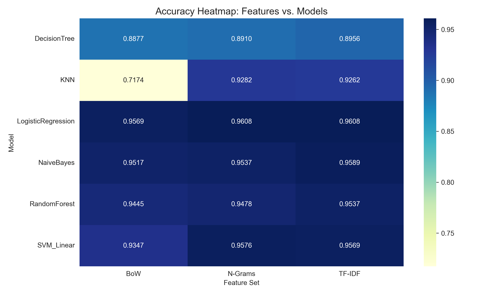

# 📰🏀⚖️ Sports vs. Politics News Classification

This repository contains the end-to-end implementation of a high-performance Natural Language Understanding (NLU) system designed to categorize news articles into **Sport** or **Politics** domains.

By evaluating six machine learning architectures across multiple feature representations, this project identifies the optimal pipeline for topical separability in digital journalism.

---

## 🚀 Peak Accuracy: **96.08%**
**Logistic Regression + TF-IDF**

---

## 📌 Project Overview

In an era of information overload, automated text categorization is essential for effective content discovery.

This project utilizes a **Master Dataset (N = 7,658)** synthesized from four primary streams — including real-time web scraping and benchmark newsgroups — to train robust classifiers.

---

## 🔍 Key Features

- **Multi-Channel Data Acquisition:** Integrated data from BBC/Guardian (scraped), 20 Newsgroups, HuffPost, and Kaggle repositories.
- **Advanced Preprocessing:** Implemented a sequential cleaning pipeline using NLTK, including normalization, stop-word filtration, and WordNet lemmatization.
- **Comparative Feature Engineering:** Systematically compared **Bag of Words (BoW)**, **N-Grams**, and **TF-IDF** vectorization.
- **Extensive Model Benchmarking:** Evaluated 18 distinct experimental configurations (6 models × 3 representations).

---
## 📊 Performance Analysis



The system identifies **Logistic Regression with TF-IDF** as the superior architecture.

Notably, feature scaling proved critical for instance-based learners — the **KNN model saw a 20% accuracy surge** when transitioning from BoW to TF-IDF.

### 📈 Top Model Metrics (TF-IDF Representation)

| Model | Accuracy | Precision | Recall | F1-Score |
|-------|----------|-----------|--------|----------|
| **Logistic Regression** | **0.9608** | **0.9615** | **0.9608** | **0.9608** |
| Naive Bayes | 0.9589 | 0.9595 | 0.9589 | 0.9588 |
| SVM (Linear) | 0.9569 | 0.9570 | 0.9569 | 0.9569 |

---

## 📊 Visual Validation

- **ROC-AUC Curves:** Achieved scores **> 0.99** for top-tier models, indicating near-perfect topical separability.
- **Accuracy Heatmap:** Demonstrates the critical dependency of KNN on TF-IDF weighting.
- **Confusion Matrices:** Detailed error analysis highlighting baseline KNN-BoW misclassification patterns.
---

## 📂 Repository Structure

Below is the complete project hierarchy. Note that files marked as *(Generated)* will appear after running the corresponding scripts.

```bash
├── plots/
│   ├── class_dist.png                # Class distribution visualization (Generated)
│   ├── word_dist.png                 # Word count density profiles (Generated)
│   ├── source_comp.png               # Article contribution by source (Generated)
│   ├── preprocessing_comparison.png  # Raw vs. Cleaned text visual (Generated)
│   ├── accuracy_heatmap_final.png    # 6x3 Performance matrix (Generated)
│   ├── advanced_curves.png           # ROC and Precision-Recall curves (Generated)
│   ├── metric_comparison_final.png   # Bar chart of top model metrics (Generated)
│   └── best_vs_worst_confusion.png   # Comparative error analysis (Generated)
├── sports_politics_data/             # Folder containing raw .txt files (Populated by scraping)
│   ├── politics/                     # Subfolder for Politics corpus
│   └── sports/                       # Subfolder for Sports corpus
├── trained_models/                   # 18 .pkl model files (Generated by model_training.py)
│   ├── LogisticRegression_TF-IDF.pkl # Top performing model
│   └── ... (other architecture/feature combinations)
├── scrape_bbc.py                     # Web crawler for real-time journalism extraction
├── kaggle_data.py                    # Converter for JSON-based news datasets to .txt format
├── 20newsgroup_data.py               # Integration script for the 20 Newsgroups benchmark
├── final_master_dataset.csv          # Combined raw dataset (Generated)
├── final_dataset.py                  # Deduplication and standardization script
├── final_master_dataset_v2.csv       # Optimized dataset for training (Generated)
├── preprocessing.py                  # NLTK cleaning pipeline script
├── dataset_preprocessed.csv          # Final cleaned data for modeling (Generated)
├── features.pkl                      # Serialized feature vectors (Generated)
├── data_description.py               # Script for statistical EDA and plotting
├── model_training.py                 # Core training script for 6 ML architectures
├── full_evaluation_metrics.csv       # Quantitative results for all models (Generated)
├── model_comparison_plots.py         # Script to generate performance visualizations
└── News_Category_Dataset_v3.json     # Source data (Download required)
```

---

## ⚙️ Installation & Execution Workflow

Follow the steps below to fully reproduce the results.

---

### 1️⃣ Clone the Repository

```bash
git clone https://github.com/your-username/news-classification-nlu.git
cd news-classification-nlu
```

---

### 2️⃣ Install Dependencies

```bash
pip install pandas numpy scikit-learn nltk beautifulsoup4 requests
```

---

### 3️⃣ External Data Requirements

To execute the full pipeline, download the following datasets and place them in the **root directory** of the project:

- **HuffPost News Category Dataset**  
  https://www.kaggle.com/datasets/rmisra/news-category-dataset

- **Article Dataset-2**  
  https://www.kaggle.com/datasets/amunsentom/article-dataset-2

> ⚠️ Ensure the downloaded JSON/CSV files are placed in the project root before running the scripts.

---

## 🔄 4️⃣ Sequential Execution Order

Run the following scripts **in order**:

| Step | Command | Description | Expected Output |
|------|----------|------------|----------------|
| 1 | `python scrape_bbc.py` | Scrapes BBC/Guardian articles | Raw `.txt` files in `sports_politics_data/` |
| 2 | `python kaggle_data.py` | Processes downloaded Kaggle JSON data | Converted `.txt` files in `sports_politics_data/` |
| 3 | `python 20newsgroup_data.py` | Fetches 20 Newsgroups benchmark | `final_master_dataset.csv` |
| 4 | `python final_dataset.py` | Standardizes sources & removes duplicates (MD5) | `final_master_dataset_v2.csv` |
| 5 | `python preprocessing.py` | Cleans text (lemmatization, stop-word removal) | `dataset_preprocessed.csv` |
| 6 | `python data_description.py` | Performs statistical EDA | `class_dist.png`, `word_dist.png`, `source_comp.png` |
| 7 | `python model_training.py` | Trains 6 ML models × 3 feature sets | 18 `.pkl` models + `evaluation_metrics.csv` |
| 8 | `python model_comparison_plots.py` | Generates performance visualizations | `accuracy_heatmap_final.png`, ROC/PR curves |

---

### 📌 Complete Pipeline Summary

1. Scrape + integrate datasets  
2. Merge & deduplicate corpus  
3. Apply NLTK preprocessing  
4. Perform EDA  
5. Train 6 models × 3 feature sets  
6. Generate evaluation metrics & visualizations  

---

> ✅ After completing all steps, the repository will contain trained models, evaluation metrics, and visualization outputs identical to those reported in the accompanying report.

---

## 🎓 Academic Context

- **Developer:** Vandita Gupta (B23CM1061)
- **Institution:** Indian Institute of Technology Jodhpur
- **Course:** Natural Language Understanding (NLU)

---
